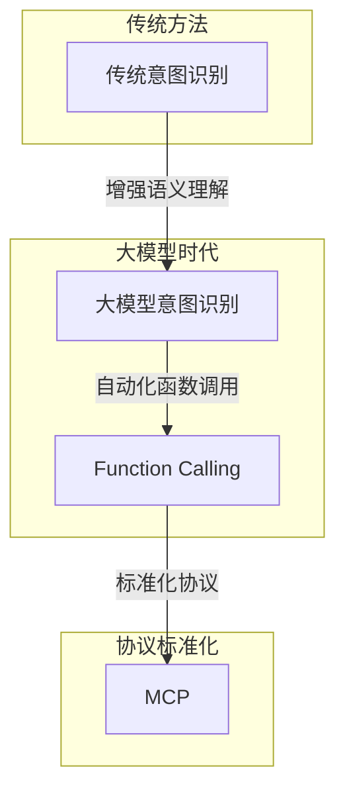
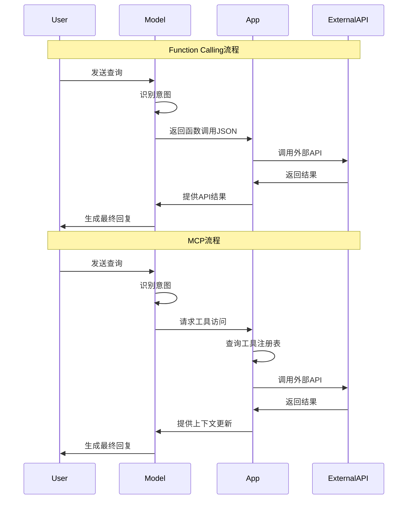
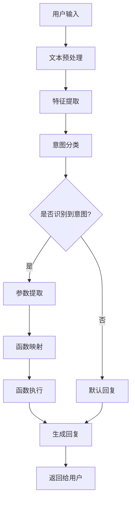
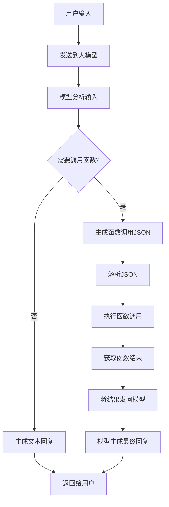
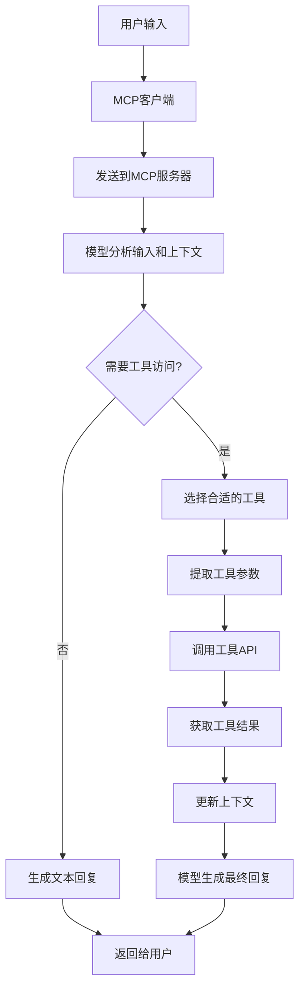
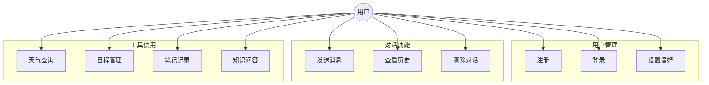
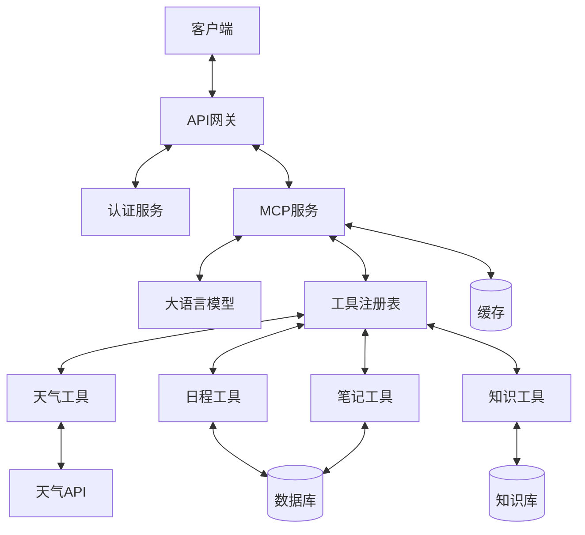
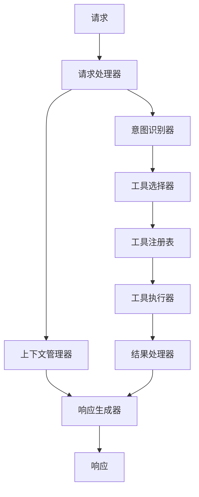

# AI 大模型应用开发实战：从意图识别到Function Calling，再到MCP开发新范式

**关键词**：AI大模型、意图识别、Function Calling、MCP、模型上下文协议、智能体开发

**摘要**：本文深入探讨了AI大模型应用开发的技术演进，从最初的手动编码进行意图识别，到意图承接函数调用，再到大模型内置的Function Calling机制，最后介绍了由Anthropic提出的MCP（模型上下文协议）开发模式转变。文章通过实例代码和架构图解，详细阐述了各种技术方案的原理、优缺点和实际应用，帮助开发者理解如何构建更智能、更高效的AI应用。同时，文章也展望了这一技术领域的未来发展趋势，为开发者提供了实用的开发指南和最佳实践。


## 1. 问题背景：AI应用开发的挑战与演进

想象一下，小明是一名热爱科技的小学生，他最近得到了一个智能机器人作为生日礼物。这个机器人可以回答问题、讲故事，甚至帮他查询天气。小明很好奇，为什么当他说"今天天气怎么样"时，机器人能准确地给出他所在城市的天气信息？而当他说"给我讲个故事"时，机器人又能切换到讲故事模式？

这个看似简单的互动背后，其实隐藏着AI应用开发中的一个核心挑战：如何让AI系统准确理解用户意图，并执行相应的操作。在AI大模型出现之前，开发者需要通过复杂的规则和算法来识别用户意图，然后调用相应的函数或API。随着技术的发展，这一过程经历了几个重要的演进阶段。

早期的AI应用开发，就像是教机器人认识不同的指令卡片。每当用户说出某句话，系统就要在一堆卡片中找出最匹配的那一张，然后执行相应的操作。这种方法虽然直观，但需要开发者预先定义所有可能的指令和对应的处理逻辑，灵活性有限。

随着大模型技术的出现，AI系统获得了更强的语言理解能力，但如何让这些模型与外部世界交互，执行实际的操作，仍然是一个挑战。这就好比给了机器人一个超级大脑，但它还需要知道如何使用这个大脑来操控自己的"手脚"。

## 2. 问题定义：从意图识别到函数调用的技术挑战

在AI应用开发中，我们面临的核心问题是：如何让AI系统准确理解用户的意图，并将这种理解转化为具体的操作或函数调用？

这个问题可以分解为几个关键挑战：

1. **意图识别**：如何从用户的自然语言输入中识别出他们的真实意图？
2. **参数提取**：一旦识别出意图，如何提取执行相应操作所需的参数？
3. **函数映射**：如何将识别出的意图映射到具体的函数或API调用？
4. **执行与反馈**：如何执行这些函数调用并将结果反馈给用户？

举个简单的例子，当用户说"查询北京明天的天气"时：
- 意图识别：系统需要理解这是一个"查询天气"的意图
- 参数提取：需要提取"北京"（地点）和"明天"（时间）这两个参数
- 函数映射：将这个意图映射到`get_weather(location, date)`函数
- 执行与反馈：调用天气API获取数据，并以用户友好的方式呈现结果

这个过程看似简单，但在实际应用中充满挑战。用户的表达方式多种多样，可能会说"北京明天天气怎么样"、"明天北京会下雨吗"或"我想知道明天北京的气温"，所有这些表达都指向同一个意图，但表达形式各不相同。

传统的方法是通过关键词匹配、规则引擎或简单的机器学习模型来识别意图，但这些方法往往需要大量的人工规则定义和数据标注，且难以处理复杂或模糊的表达。

## 3. 问题分析与解决：技术演进的四个阶段

### 3.1 第一阶段：基于规则的意图识别

最早的意图识别系统主要基于规则和模式匹配。这就像是给机器人准备了一本"指令手册"，里面列出了各种可能的用户表达和对应的意图。

```python
# 基于规则的简单意图识别示例
def identify_intent(user_input):
    user_input = user_input.lower()
    
    # 天气查询意图
    if any(keyword in user_input for keyword in ["天气", "气温", "下雨", "晴天"]):
        return "weather_query"
    
    # 时间查询意图
    elif any(keyword in user_input for keyword in ["几点", "时间", "日期"]):
        return "time_query"
    
    # 默认意图
    else:
        return "unknown"
```

这种方法的优点是实现简单、执行高效，但缺点也很明显：
- 需要手动定义大量规则
- 难以处理自然语言的多样性和复杂性
- 扩展性差，每增加一种意图都需要定义新规则

### 3.2 第二阶段：机器学习时代的意图识别

随着机器学习技术的发展，意图识别系统开始采用监督学习方法，通过标注数据训练分类模型来识别用户意图。

```python
# 使用机器学习进行意图识别的简化示例
from sklearn.feature_extraction.text import TfidfVectorizer
from sklearn.svm import SVC

# 准备训练数据
training_data = [
    ("今天天气怎么样", "weather_query"),
    ("北京明天会下雨吗", "weather_query"),
    ("现在几点了", "time_query"),
    ("告诉我现在的时间", "time_query"),
    # 更多训练数据...
]

texts, labels = zip(*training_data)

# 特征提取
vectorizer = TfidfVectorizer()
X = vectorizer.fit_transform(texts)

# 训练模型
model = SVC()
model.fit(X, labels)

# 预测函数
def predict_intent(user_input):
    features = vectorizer.transform([user_input])
    intent = model.predict(features)[0]
    return intent
```

这种方法相比规则引擎有了显著改进：
- 能够学习语言的多样性，处理不同表达方式
- 随着训练数据增加，识别准确率提高
- 更容易扩展到新的意图类别

但它仍然存在局限性：
- 需要大量标注数据
- 难以处理上下文信息
- 参数提取仍需单独处理

### 3.3 第三阶段：大模型时代的手动意图识别与函数调用

随着GPT、Claude等大型语言模型的出现，意图识别能力得到了质的飞跃。这些模型具有强大的语言理解能力，可以更准确地理解用户意图。然而，在早期阶段，开发者仍需手动编写代码来解析模型输出并调用相应的函数。

```python
import openai

def get_weather(location, date):
    # 调用天气API获取数据
    return f"{location}在{date}的天气晴朗，气温25°C"

def get_time(location=None):
    # 获取当前时间或特定地区时间
    return "当前北京时间是14:30"

def chat_with_function_calling(user_input):
    # 调用大模型获取回复
    response = openai.ChatCompletion.create(
        model="gpt-3.5-turbo",
        messages=[
            {"role": "system", "content": "你是一个助手，可以回答问题并执行任务。"},
            {"role": "user", "content": user_input}
        ]
    )
    
    model_response = response.choices[0].message.content
    
    # 手动解析模型回复，识别意图和参数
    if "天气" in model_response and "北京" in model_response:
        weather_info = get_weather("北京", "今天")
        return f"根据查询：{weather_info}"
    elif "时间" in model_response:
        time_info = get_time()
        return f"现在的时间是：{time_info}"
    else:
        return model_response
```

这种方法的问题在于：
- 仍然需要手动编写规则来解析模型输出
- 难以扩展到复杂的应用场景
- 容易出现解析错误，导致函数调用不准确

### 3.4 第四阶段：Function Calling机制的出现

为了解决上述问题，OpenAI在2023年引入了Function Calling机制，允许开发者向模型描述可用的函数，模型会自动决定何时调用这些函数，并生成符合函数参数要求的JSON格式输出。

```python
import openai
import json

def get_weather(location, date):
    # 实际应用中会调用天气API
    return f"{location}在{date}的天气晴朗，气温25°C"

# 定义可用函数
available_functions = {
    "get_weather": get_weather
}

# 函数描述
functions = [
    {
        "name": "get_weather",
        "description": "获取指定地点和日期的天气信息",
        "parameters": {
            "type": "object",
            "properties": {
                "location": {
                    "type": "string",
                    "description": "城市名称，如北京、上海"
                },
                "date": {
                    "type": "string",
                    "description": "日期，如今天、明天、后天"
                }
            },
            "required": ["location", "date"]
        }
    }
]

def chat_with_function_calling(user_input):
    messages = [
        {"role": "system", "content": "你是一个助手，可以回答问题并执行任务。"},
        {"role": "user", "content": user_input}
    ]
    
    response = openai.ChatCompletion.create(
        model="gpt-3.5-turbo-0613",
        messages=messages,
        functions=functions,
        function_call="auto"
    )
    
    response_message = response.choices[0].message
    
    # 检查模型是否想要调用函数
    if response_message.get("function_call"):
        function_name = response_message["function_call"]["name"]
        function_args = json.loads(response_message["function_call"]["arguments"])
        
        # 调用相应的函数
        if function_name in available_functions:
            function_response = available_functions[function_name](**function_args)
            
            # 将函数执行结果添加到对话历史
            messages.append(response_message)
            messages.append(
                {
                    "role": "function",
                    "name": function_name,
                    "content": function_response
                }
            )
            
            # 让模型生成最终回复
            second_response = openai.ChatCompletion.create(
                model="gpt-3.5-turbo-0613",
                messages=messages
            )
            
            return second_response.choices[0].message["content"]
    
    # 如果模型没有调用函数，直接返回回复
    return response_message["content"]
```

Function Calling机制的优势在于：
- 模型自动决定何时调用函数，无需手动解析
- 自动提取参数并生成符合要求的JSON格式
- 更容易扩展到复杂的应用场景
- 减少了开发者的工作量和错误率

### 3.5 第五阶段：MCP（模型上下文协议）开发模式

最新的发展是Anthropic在2024年底推出的MCP（Model Context Protocol，模型上下文协议），这是一种更加结构化和标准化的方式，用于大模型与外部工具和服务进行交互。

MCP通过标准化的接口实现大语言模型与外部数据源及工具的无缝集成，提供了比Function Calling更加完整和灵活的解决方案。

```python
# MCP服务器示例（简化版）
from fastapi import FastAPI, HTTPException
from pydantic import BaseModel
import requests
import json

app = FastAPI()

class MCPRequest(BaseModel):
    messages: list
    context: dict = None

class WeatherRequest(BaseModel):
    location: str
    date: str

@app.post("/weather")
async def get_weather(request: WeatherRequest):
    # 调用实际的天气API
    # 这里简化为返回固定数据
    return {"temperature": 25, "condition": "晴朗", "location": request.location, "date": request.date}

@app.post("/mcp")
async def mcp_endpoint(request: MCPRequest):
    # 分析用户最后一条消息
    user_message = next((msg for msg in reversed(request.messages) if msg.get("role") == "user"), None)
    
    if not user_message:
        raise HTTPException(status_code=400, detail="No user message found")
    
    user_content = user_message.get("content", "")
    
    # 简单的意图识别（实际应用中会使用大模型来识别）
    if "天气" in user_content:
        # 提取参数（实际应用中会使用更复杂的方法）
        location = "北京"  # 默认值
        date = "今天"      # 默认值
        
        if "上海" in user_content:
            location = "上海"
        if "明天" in user_content:
            date = "明天"
        
        # 调用天气服务
        weather_data = await get_weather(WeatherRequest(location=location, date=date))
        
        # 构建MCP响应
        return {
            "messages": request.messages + [
                {
                    "role": "assistant",
                    "content": f"{location}在{date}的天气{weather_data['condition']}，气温{weather_data['temperature']}°C"
                }
            ],
            "context": {
                "weather_data": weather_data
            }
        }
    
    # 如果没有识别到特定意图，返回默认回复
    return {
        "messages": request.messages + [
            {
                "role": "assistant",
                "content": "我不确定您想查询什么信息。您可以问我天气、时间等问题。"
            }
        ],
        "context": request.context
    }
```

MCP的核心优势包括：

1. **标准化接口**：提供了统一的接口规范，使大模型与外部工具的交互更加一致和可预测
2. **上下文管理**：更好地管理对话上下文和工具调用状态
3. **多工具协作**：支持多个工具之间的协作和数据共享
4. **跨平台兼容**：不同的模型和工具可以通过MCP进行互操作

## 4. 方案核心概念：从意图识别到MCP的技术原理

### 4.1 意图识别的本质

意图识别本质上是一个分类问题，目标是将用户的自然语言输入映射到预定义的意图类别。这就像是理解一个句子的"目的"或"动机"，而不仅仅是其字面含义。

举个生活中的例子，当我们在餐厅对服务员说"这里有点冷"时，我们的实际意图可能是"请调高空调温度"，而不是单纯陈述一个事实。人类服务员能够理解这种隐含意图，而AI系统也需要具备类似的能力。

在技术实现上，意图识别可以通过以下方法实现：

1. **基于规则**：使用关键词匹配、正则表达式等规则来识别意图
2. **基于机器学习**：使用分类算法（如SVM、随机森林）来学习意图模式
3. **基于深度学习**：使用神经网络（如LSTM、BERT）来理解语义并识别意图
4. **基于大模型**：利用GPT、Claude等大型语言模型的强大语义理解能力

### 4.2 Function Calling的工作原理

Function Calling是一种让大语言模型与外部函数或API交互的机制。它的工作原理可以类比为"翻译官"的角色：将用户的自然语言请求翻译成计算机可以理解的函数调用。

具体来说，Function Calling的工作流程包括以下步骤：

1. **函数定义**：开发者向模型提供可用函数的描述，包括函数名、参数及其类型
2. **意图识别**：模型分析用户输入，判断是否需要调用函数
3. **参数提取**：如果需要调用函数，模型从用户输入中提取必要的参数
4. **生成调用格式**：模型生成符合要求的函数调用格式（通常是JSON）
5. **函数执行**：开发者的代码接收这些参数并执行实际的函数调用
6. **结果整合**：将函数执行结果反馈给模型，生成最终回复

这个过程的数学模型可以表示为：

$$P(f, \theta | x) = \frac{P(x | f, \theta) \cdot P(f, \theta)}{P(x)}$$

其中：
- $x$ 是用户输入
- $f$ 是函数名
- $\theta$ 是函数参数
- $P(f, \theta | x)$ 是给定用户输入时，选择特定函数和参数的概率

Function Calling的实现依赖于模型在训练过程中学习到的模式，特别是理解函数定义和生成符合要求的JSON格式的能力。

### 4.3 MCP（模型上下文协议）的技术架构

MCP是一种更加结构化和标准化的协议，用于大模型与外部工具和服务进行交互。它的核心理念是将模型视为一个"思考引擎"，而将具体的操作交给专门的工具来执行。

MCP的技术架构包括以下核心组件：

1. **MCP服务器**：处理模型与工具之间的通信
2. **工具注册表**：管理可用工具的描述和调用方法
3. **上下文管理器**：维护对话状态和工具调用历史
4. **请求处理器**：解析用户请求并路由到相应的工具
5. **响应生成器**：整合工具执行结果，生成最终回复

MCP的工作流程可以用以下算法表示：

```
函数 MCP处理(用户输入, 对话历史, 上下文):
    1. 分析用户输入和对话历史
    2. 识别用户意图
    3. 如果需要调用工具:
        a. 从工具注册表中选择合适的工具
        b. 提取必要的参数
        c. 调用工具并获取结果
        d. 更新上下文
    4. 生成回复
    5. 返回(回复, 更新后的上下文)
```

MCP的一个关键创新是引入了结构化的"上下文"概念，使模型能够更好地理解和管理对话状态，从而提供更连贯和个性化的交互体验。

## 5. 方案概念结构与核心要素组成

### 5.1 意图识别、Function Calling和MCP的概念对比

| 特性 | 传统意图识别 | Function Calling | MCP |
|------|------------|-----------------|-----|
| 实现方式 | 规则引擎或机器学习 | 大模型内置能力 | 标准化协议 |
| 参数提取 | 需单独处理 | 自动提取 | 自动提取 |
| 上下文管理 | 有限支持 | 基本支持 | 完整支持 |
| 多工具协作 | 困难 | 支持但有限 | 原生支持 |
| 开发复杂度 | 高 | 中 | 低 |
| 扩展性 | 差 | 好 | 极佳 |
| 标准化程度 | 低 | 中 | 高 |
| 跨平台兼容性 | 差 | 中 | 好 |

### 5.2 技术架构的演进关系



### 5.3 Function Calling与MCP的交互流程对比



## 6. 数学模型：意图识别与函数调用的形式化表示

### 6.1 意图识别的数学模型

意图识别本质上是一个条件概率问题，可以表示为：

$$P(I|U) = \frac{P(U|I) \cdot P(I)}{P(U)}$$

其中：
- $I$ 是意图
- $U$ 是用户输入
- $P(I|U)$ 是给定用户输入时，特定意图的概率
- $P(U|I)$ 是给定意图时，观察到特定用户输入的概率
- $P(I)$ 是意图的先验概率
- $P(U)$ 是用户输入的边缘概率

在实际应用中，我们通常使用最大后验概率（MAP）估计来确定最可能的意图：

$$I^* = \arg\max_I P(I|U)$$

### 6.2 Function Calling的数学表示

Function Calling可以看作是一个联合概率分布问题，涉及函数选择和参数提取：

$$P(f, \theta | U, \mathcal{F}) = \frac{P(U | f, \theta, \mathcal{F}) \cdot P(f, \theta | \mathcal{F})}{P(U | \mathcal{F})}$$

其中：
- $f$ 是函数名
- $\theta$ 是函数参数
- $U$ 是用户输入
- $\mathcal{F}$ 是可用函数集合
- $P(f, \theta | U, \mathcal{F})$ 是给定用户输入和可用函数集合时，选择特定函数和参数的概率

模型的目标是找到最优的函数和参数组合：

$$f^*, \theta^* = \arg\max_{f, \theta} P(f, \theta | U, \mathcal{F})$$

### 6.3 MCP的形式化模型

MCP引入了上下文管理，可以表示为一个马尔可夫决策过程（MDP）：

$$P(A_t, C_t | U_t, H_t, C_{t-1}) = P(A_t | U_t, H_t, C_{t-1}) \cdot P(C_t | A_t, U_t, H_t, C_{t-1})$$

其中：
- $U_t$ 是当前用户输入
- $H_t$ 是对话历史
- $C_{t-1}$ 是前一状态的上下文
- $A_t$ 是当前操作（可能是工具调用）
- $C_t$ 是更新后的上下文
- $P(A_t, C_t | U_t, H_t, C_{t-1})$ 是给定当前状态时，选择特定操作和更新上下文的联合概率

MCP的目标是最大化长期效用，而不仅仅是当前响应的质量：

$$\max_{\pi} \mathbb{E}\left[\sum_{t=0}^{T} \gamma^t R(U_t, A_t, C_t)\right]$$

其中：
- $\pi$ 是策略函数
- $\gamma$ 是折扣因子
- $R$ 是奖励函数
- $T$ 是对话长度

## 7. 算法流程图：从用户输入到函数执行的完整过程

### 7.1 传统意图识别流程



### 7.2 Function Calling流程



### 7.3 MCP工作流程



## 8. 实际场景应用：AI大模型应用开发案例

### 8.1 智能客服系统

智能客服是Function Calling和MCP的典型应用场景。传统客服系统往往采用基于规则的意图识别，只能处理有限的问题类型。使用Function Calling和MCP后，系统可以处理更复杂的查询，并与企业内部系统无缝集成。

**应用案例**：某电商平台的智能客服系统，能够处理订单查询、退换货申请、商品推荐等多种业务场景。

```python
# 使用Function Calling的智能客服系统示例
import openai
import json

# 定义可用函数
def check_order_status(order_id):
    # 实际应用中会查询订单系统
    return {"status": "已发货", "shipping_company": "顺丰速运", "tracking_number": "SF1234567890"}

def process_return(order_id, reason):
    # 实际应用中会调用退货处理系统
    return {"return_id": "R2023001", "status": "已受理", "refund_amount": 299.00}

def recommend_products(category, price_range=None):
    # 实际应用中会调用推荐引擎
    products = [
        {"id": "P001", "name": "智能手表", "price": 1299.00},
        {"id": "P002", "name": "无线耳机", "price": 899.00},
        {"id": "P003", "name": "蓝牙音箱", "price": 399.00}
    ]
    return {"products": products}

# 函数映射
available_functions = {
    "check_order_status": check_order_status,
    "process_return": process_return,
    "recommend_products": recommend_products
}

# 函数描述
functions = [
    {
        "name": "check_order_status",
        "description": "查询订单状态",
        "parameters": {
            "type": "object",
            "properties": {
                "order_id": {
                    "type": "string",
                    "description": "订单编号"
                }
            },
            "required": ["order_id"]
        }
    },
    {
        "name": "process_return",
        "description": "处理退货申请",
        "parameters": {
            "type": "object",
            "properties": {
                "order_id": {
                    "type": "string",
                    "description": "订单编号"
                },
                "reason": {
                    "type": "string",
                    "description": "退货原因"
                }
            },
            "required": ["order_id", "reason"]
        }
    },
    {
        "name": "recommend_products",
        "description": "推荐商品",
        "parameters": {
            "type": "object",
            "properties": {
                "category": {
                    "type": "string",
                    "description": "商品类别"
                },
                "price_range": {
                    "type": "string",
                    "description": "价格范围，如'0-1000'"
                }
            },
            "required": ["category"]
        }
    }
]

def customer_service_bot(user_input):
    messages = [
        {"role": "system", "content": "你是一个电商平台的客服助手，可以帮助用户查询订单、处理退货和推荐商品。"},
        {"role": "user", "content": user_input}
    ]
    
    response = openai.ChatCompletion.create(
        model="gpt-3.5-turbo-0613",
        messages=messages,
        functions=functions,
        function_call="auto"
    )
    
    response_message = response.choices[0].message
    
    # 检查模型是否想要调用函数
    if response_message.get("function_call"):
        function_name = response_message["function_call"]["name"]
        function_args = json.loads(response_message["function_call"]["arguments"])
        
        # 调用相应的函数
        if function_name in available_functions:
            function_response = available_functions[function_name](**function_args)
            
            # 将函数执行结果添加到对话历史
            messages.append(response_message)
            messages.append(
                {
                    "role": "function",
                    "name": function_name,
                    "content": json.dumps(function_response)
                }
            )
            
            # 让模型生成最终回复
            second_response = openai.ChatCompletion.create(
                model="gpt-3.5-turbo-0613",
                messages=messages
            )
            
            return second_response.choices[0].message["content"]
    
    # 如果模型没有调用函数，直接返回回复
    return response_message["content"]
```

### 8.2 智能家居控制系统

智能家居是另一个典型的应用场景，用户可以通过自然语言控制家中的各种设备。

**应用案例**：使用MCP构建的智能家居控制中心，能够控制灯光、空调、窗帘等设备，并根据用户习惯提供个性化建议。

```python
# 使用MCP的智能家居控制系统示例
from fastapi import FastAPI, HTTPException
from pydantic import BaseModel
import requests
import json

app = FastAPI()

class MCPRequest(BaseModel):
    messages: list
    context: dict = None

class DeviceControlRequest(BaseModel):
    device_id: str
    action: str
    parameters: dict = None

# 模拟设备控制API
def control_device(device_id, action, parameters=None):
    devices = {
        "light_living_room": {"name": "客厅灯", "type": "light", "status": "off"},
        "ac_bedroom": {"name": "卧室空调", "type": "ac", "status": "off", "temperature": 26},
        "curtain_living_room": {"name": "客厅窗帘", "type": "curtain", "status": "closed"}
    }
    
    if device_id not in devices:
        return {"error": "设备不存在"}
    
    device = devices[device_id]
    
    if action == "turn_on":
        device["status"] = "on"
    elif action == "turn_off":
        device["status"] = "off"
    elif action == "set_temperature" and device["type"] == "ac" and parameters and "temperature" in parameters:
        device["temperature"] = parameters["temperature"]
    elif action == "open" and device["type"] == "curtain":
        device["status"] = "open"
    elif action == "close" and device["type"] == "curtain":
        device["status"] = "closed"
    else:
        return {"error": "不支持的操作"}
    
    return {"device": device_id, "name": device["name"], "action": action, "status": device["status"]}

@app.post("/mcp")
async def mcp_endpoint(request: MCPRequest):
    # 分析用户最后一条消息
    user_message = next((msg for msg in reversed(request.messages) if msg.get("role") == "user"), None)
    
    if not user_message:
        raise HTTPException(status_code=400, detail="No user message found")
    
    user_content = user_message.get("content", "")
    context = request.context or {}
    
    # 简单的意图识别（实际应用中会使用大模型来识别）
    if "灯" in user_content or "light" in user_content.lower():
        device_id = "light_living_room"
        action = "turn_on" if any(word in user_content for word in ["开", "打开", "turn on"]) else "turn_off"
        
        # 调用设备控制API
        result = control_device(device_id, action)
        
        # 更新上下文
        if "devices" not in context:
            context["devices"] = {}
        context["devices"][device_id] = result
        
        # 构建MCP响应
        return {
            "messages": request.messages + [
                {
                    "role": "assistant",
                    "content": f"已{action}客厅灯。"
                }
            ],
            "context": context
        }
    elif "空调" in user_content or "ac" in user_content.lower():
        device_id = "ac_bedroom"
        
        if any(word in user_content for word in ["温度", "temperature"]):
            # 提取温度值（简化实现）
            import re
            temp_match = re.search(r'(\d+)度', user_content)
            temperature = int(temp_match.group(1)) if temp_match else 26
            
            result = control_device(device_id, "set_temperature", {"temperature": temperature})
            action_desc = f"已将卧室空调温度设置为{temperature}度"
        else:
            action = "turn_on" if any(word in user_content for word in ["开", "打开", "turn on"]) else "turn_off"
            result = control_device(device_id, action)
            action_desc = f"已{action}卧室空调"
        
        # 更新上下文
        if "devices" not in context:
            context["devices"] = {}
        context["devices"][device_id] = result
        
        return {
            "messages": request.messages + [
                {
                    "role": "assistant",
                    "content": action_desc
                }
            ],
            "context": context
        }
    
    # 如果没有识别到特定意图，返回默认回复
    return {
        "messages": request.messages + [
            {
                "role": "assistant",
                "content": "我不确定您想控制哪个设备。您可以尝试说'打开客厅灯'或'设置卧室空调温度为25度'。"
            }
        ],
        "context": context
    }
```

### 8.3 智能搜索引擎

智能搜索引擎是Function Calling和MCP的另一个重要应用场景，它可以帮助用户更精确地获取所需信息。

**应用案例**：基于MCP的企业内部知识库搜索系统，能够理解复杂查询，并从多个数据源获取信息。

```python
# 使用MCP的智能搜索引擎示例
from fastapi import FastAPI, HTTPException
from pydantic import BaseModel
import json

app = FastAPI()

class MCPRequest(BaseModel):
    messages: list
    context: dict = None

class SearchRequest(BaseModel):
    query: str
    filters: dict = None
    page: int = 1
    page_size: int = 10

# 模拟搜索API
def search_knowledge_base(query, filters=None, page=1, page_size=10):
    # 实际应用中会查询数据库或搜索引擎
    results = [
        {"id": "doc1", "title": "产品使用手册", "content": "这是产品A的使用手册，包含安装、配置和故障排除等内容。"},
        {"id": "doc2", "title": "API文档", "content": "这是API文档，描述了所有可用的接口及其参数。"},
        {"id": "doc3", "title": "常见问题解答", "content": "这是常见问题解答，包含用户经常遇到的问题及其解决方案。"}
    ]
    
    # 简单的关键词过滤
    if query:
        results = [doc for doc in results if query.lower() in doc["title"].lower() or query.lower() in doc["content"].lower()]
    
    # 应用过滤条件
    if filters:
        if "doc_type" in filters:
            results = [doc for doc in results if filters["doc_type"].lower() in doc["title"].lower()]
    
    # 分页
    start = (page - 1) * page_size
    end = start + page_size
    paginated_results = results[start:end]
    
    return {
        "query": query,
        "total": len(results),
        "page": page,
        "page_size": page_size,
        "results": paginated_results
    }

@app.post("/mcp")
async def mcp_endpoint(request: MCPRequest):
    # 分析用户最后一条消息
    user_message = next((msg for msg in reversed(request.messages) if msg.get("role") == "user"), None)
    
    if not user_message:
        raise HTTPException(status_code=400, detail="No user message found")
    
    user_content = user_message.get("content", "")
    context = request.context or {}
    
    # 简单的意图识别（实际应用中会使用大模型来识别）
    if any(word in user_content.lower() for word in ["查找", "搜索", "find", "search"]):
        # 提取查询关键词（简化实现）
        query = user_content.split("搜索")[-1].strip() if "搜索" in user_content else user_content
        
        # 提取过滤条件（简化实现）
        filters = {}
        if "手册" in user_content or "manual" in user_content.lower():
            filters["doc_type"] = "手册"
        elif "API" in user_content.upper():
            filters["doc_type"] = "API"
        elif "问题" in user_content or "FAQ" in user_content.upper():
            filters["doc_type"] = "FAQ"
        
        # 调用搜索API
        search_results = search_knowledge_base(query, filters)
        
        # 更新上下文
        context["last_search"] = {
            "query": query,
            "filters": filters,
            "results": search_results
        }
        
        # 构建回复内容
        if search_results["total"] > 0:
            result_items = "\n".join([f"- {doc['title']}: {doc['content'][:100]}..." for doc in search_results["results"]])
            response_content = f"找到{search_results['total']}个相关文档：\n\n{result_items}"
        else:
            response_content = f"没有找到与'{query}'相关的文档。请尝试其他关键词。"
        
        # 构建MCP响应
        return {
            "messages": request.messages + [
                {
                    "role": "assistant",
                    "content": response_content
                }
            ],
            "context": context
        }
    
    # 如果没有识别到特定意图，返回默认回复
    return {
        "messages": request.messages + [
            {
                "role": "assistant",
                "content": "我可以帮您搜索知识库中的信息。请尝试说'搜索产品手册'或'查找API文档'。"
            }
        ],
        "context": context
    }
```

## 9. 项目介绍：构建一个基于MCP的智能助手

下面我们将介绍一个完整的项目：基于MCP的多功能智能助手，它集成了天气查询、日程管理、笔记记录等功能。

### 9.1 项目概述

这个智能助手采用MCP架构，能够理解用户的自然语言指令，并调用相应的工具来完成任务。它的主要功能包括：

1. 天气查询：获取指定地点的天气预报
2. 日程管理：添加、查询和删除日程
3. 笔记记录：创建、查询和编辑笔记
4. 知识问答：回答用户的一般性问题

### 9.2 技术选型

- 前端：React.js + TypeScript
- 后端：FastAPI + Python
- 大模型：OpenAI GPT-4或Anthropic Claude
- 数据库：PostgreSQL
- 缓存：Redis
- 部署：Docker + Kubernetes

## 10. 环境安装

要搭建这个项目的开发环境，需要安装以下组件：

### 10.1 后端环境

```bash
# 创建虚拟环境
python -m venv venv
source venv/bin/activate  # 在Windows上使用 venv\Scripts\activate

# 安装依赖
pip install fastapi uvicorn openai anthropic pydantic sqlalchemy psycopg2-binary redis

# 创建项目目录结构
mkdir -p mcp_assistant/{api,models,services,utils}
touch mcp_assistant/__init__.py
touch mcp_assistant/api/__init__.py
touch mcp_assistant/models/__init__.py
touch mcp_assistant/services/__init__.py
touch mcp_assistant/utils/__init__.py
```

### 10.2 前端环境

```bash
# 使用Create React App创建前端项目
npx create-react-app mcp-assistant-frontend --template typescript

# 安装依赖
cd mcp-assistant-frontend
npm install axios antd @ant-design/icons react-router-dom
```

### 10.3 Docker环境

```bash
# 创建Docker文件
cat > Dockerfile <<EOF
FROM python:3.9-slim

WORKDIR /app

COPY requirements.txt .
RUN pip install --no-cache-dir -r requirements.txt

COPY . .

CMD ["uvicorn", "mcp_assistant.main:app", "--host", "0.0.0.0", "--port", "8000"]
EOF

# 创建Docker Compose文件
cat > docker-compose.yml <<EOF
version: '3'

services:
  backend:
    build: .
    ports:
      - "8000:8000"
    environment:
      - DATABASE_URL=postgresql://postgres:postgres@db:5432/mcp_assistant
      - REDIS_URL=redis://redis:6379/0
      - OPENAI_API_KEY=your_openai_api_key
    depends_on:
      - db
      - redis

  db:
    image: postgres:13
    environment:
      - POSTGRES_USER=postgres
      - POSTGRES_PASSWORD=postgres
      - POSTGRES_DB=mcp_assistant
    volumes:
      - postgres_data:/var/lib/postgresql/data

  redis:
    image: redis:6
    volumes:
      - redis_data:/data

volumes:
  postgres_data:
  redis_data:
EOF
```

## 11. 系统功能设计

### 11.1 核心功能模块

1. **用户管理模块**：
   - 用户注册、登录和认证
   - 用户偏好设置
   - 权限管理

2. **对话管理模块**：
   - 对话历史记录
   - 上下文管理
   - 消息处理

3. **工具集成模块**：
   - 工具注册和管理
   - 工具调用和结果处理
   - 工具权限控制

4. **MCP核心模块**：
   - 请求处理
   - 意图识别
   - 工具选择
   - 响应生成

### 11.2 功能用例图



## 12. 系统架构设计

### 12.1 整体架构



### 12.2 MCP服务内部架构



## 13. 系统接口设计

### 13.1 API接口设计

#### 13.1.1 用户管理接口

```
POST /api/users/register
- 功能：用户注册
- 请求体：{username, email, password}
- 响应：{user_id, username, email, token}

POST /api/users/login
- 功能：用户登录
- 请求体：{email, password}
- 响应：{user_id, username, email, token}

GET /api/users/me
- 功能：获取当前用户信息
- 请求头：Authorization: Bearer {token}
- 响应：{user_id, username, email, preferences}

PUT /api/users/preferences
- 功能：更新用户偏好设置
- 请求头：Authorization: Bearer {token}
- 请求体：{key: value, ...}
- 响应：{success: true, preferences: {key: value, ...}}
```

#### 13.1.2 对话管理接口

```
POST /api/conversations
- 功能：创建新对话
- 请求头：Authorization: Bearer {token}
- 请求体：{title}
- 响应：{conversation_id, title, created_at}

GET /api/conversations
- 功能：获取对话列表
- 请求头：Authorization: Bearer {token}
- 响应：[{conversation_id, title, created_at, updated_at}, ...]

GET /api/conversations/{conversation_id}
- 功能：获取对话详情
- 请求头：Authorization: Bearer {token}
- 响应：{conversation_id, title, messages: [{role, content, timestamp}, ...]}

POST /api/conversations/{conversation_id}/messages
- 功能：发送消息
- 请求头：Authorization: Bearer {token}
- 请求体：{content}
- 响应：{message_id, role: "assistant", content, timestamp}

DELETE /api/conversations/{conversation_id}
- 功能：删除对话
- 请求头：Authorization: Bearer {token}
- 响应：{success: true}
```

#### 13.1.3 MCP接口

```
POST /api/mcp
- 功能：MCP请求处理
- 请求头：Authorization: Bearer {token}
- 请求体：{messages: [{role, content}, ...], context: {}}
- 响应：{messages: [{role, content}, ...], context: {}}
```

### 13.2 工具接口设计

#### 13.2.1 天气工具接口

```
GET /api/tools/weather
- 功能：获取天气信息
- 请求参数：location, date
- 响应：{location, date, temperature, condition, humidity, wind}
```

#### 13.2.2 日程工具接口

```
POST /api/tools/calendar/events
- 功能：创建日程
- 请求体：{title, start_time, end_time, description}
- 响应：{event_id, title, start_time, end_time, description}

GET /api/tools/calendar/events
- 功能：查询日程
- 请求参数：start_date, end_date
- 响应：[{event_id, title, start_time, end_time, description}, ...]

DELETE /api/tools/calendar/events/{event_id}
- 功能：删除日程
- 响应：{success: true}
```

#### 13.2.3 笔记工具接口

```
POST /api/tools/notes
- 功能：创建笔记
- 请求体：{title, content, tags}
- 响应：{note_id, title, content, tags, created_at}

GET /api/tools/notes
- 功能：查询笔记
- 请求参数：query, tags
- 响应：[{note_id, title, content, tags, created_at, updated_at}, ...]

PUT /api/tools/notes/{note_id}
- 功能：更新笔记
- 请求体：{title, content, tags}
- 响应：{note_id, title, content, tags, updated_at}

DELETE /api/tools/notes/{note_id}
- 功能：删除笔记
- 响应：{success: true}
```

## 14. 最佳实践tips

### 14.1 Function Calling最佳实践

1. **函数设计原则**：
   - 函数名应清晰表达功能
   - 参数名和类型应明确定义
   - 函数描述应详细但简洁

2. **参数验证**：
   - 始终验证模型返回的参数
   - 处理缺失或无效参数的情况
   - 提供合理的默认值

3. **错误处理**：
   - 捕获并处理函数执行过程中的异常
   - 向用户提供友好的错误信息
   - 记录详细的错误日志以便调试

4. **性能优化**：
   - 缓存频繁使用的函数结果
   - 批量处理多个相关函数调用
   - 使用异步处理避免阻塞

5. **安全考虑**：
   - 限制函数的权限范围
   - 验证用户权限
   - 防止注入攻击

### 14.2 MCP开发最佳实践

1. **上下文管理**：
   - 精心设计上下文结构
   - 只存储必要的信息
   - 定期清理过期上下文

2. **工具集成**：
   - 使用标准化的工具接口
   - 实现工具版本管理
   - 提供详细的工具文档

3. **响应生成**：
   - 确保响应的一致性
   - 处理工具调用失败的情况
   - 提供有用的后备响应

4. **测试策略**：
   - 编写单元测试和集成测试
   - 模拟工具响应进行测试
   - 进行用户体验测试

5. **监控与分析**：
   - 监控系统性能和响应时间
   - 分析工具使用模式
   - 收集用户反馈以改进系统

## 15. 行业发展与未来趋势

### 15.1 AI大模型应用开发的演进历程

| 时期 | 技术特点 | 开发模式 | 典型应用 | 局限性 |
|------|---------|---------|---------|--------|
| 2010年前 | 基于规则的系统 | 手动编写规则和模式 | 简单的问答系统、IVR | 扩展性差，维护成本高 |
| 2010-2018 | 机器学习时代 | 特征工程+监督学习 | 智能客服、语音助手 | 依赖大量标注数据，领域迁移困难 |
| 2018-2022 | 预训练模型时代 | 微调+提示工程 | 智能写作、内容生成 | API调用复杂，集成困难 |
| 2022-2023 | 大模型初期 | 提示工程+手动解析 | 多模态应用、创意助手 | 工具使用能力有限，开发效率低 |
| 2023-2024 | Function Calling时代 | 函数定义+自动调用 | 智能代理、垂直领域应用 | 标准化程度不足，跨平台兼容性差 |
| 2024-至今 | MCP协议时代 | 标准化接口+工具生态 | 自主智能体、复杂业务系统 | 正在发展中 |

### 15.2 未来发展趋势

1. **智能体生态系统**：
   - 多智能体协作将成为主流
   - 专业化智能体分工合作
   - 智能体市场和生态系统形成

2. **标准化与互操作性**：
   - 更多标准协议的出现
   - 跨平台、跨模型的互操作性
   - 工具和智能体
   - 的标准化接口

3. **自主性增强**：
   - 智能体主动学习和适应
   - 长期规划和目标导向能力
   - 自我改进和自我调整

4. **多模态融合**：
   - 文本、图像、音频等多模态输入输出
   - 跨模态理解和生成
   - 实时多模态交互

5. **隐私和安全**：
   - 本地化部署和边缘计算
   - 差分隐私和联邦学习
   - 更强的安全审计和防护机制

## 16. 本章小结

本文深入探讨了AI大模型应用开发的技术演进，从最初的基于规则的意图识别，到机器学习时代的监督学习方法，再到大模型时代的手动解析和Function Calling机制，最后介绍了最新的MCP（模型上下文协议）开发模式。

我们详细分析了每种技术方案的原理、优缺点和适用场景，并通过实例代码和架构图解，展示了如何在实际项目中应用这些技术。特别是，我们重点介绍了Function Calling和MCP的工作原理和最佳实践，这两种技术代表了当前AI大模型应用开发的最新趋势。

在实际应用部分，我们展示了智能客服、智能家居和智能搜索等典型场景的实现方案，并提供了一个完整的基于MCP的智能助手项目设计，包括系统架构、功能模块和接口设计。

随着AI技术的不断发展，我们可以预见未来的AI应用开发将更加标准化、自主化和多模态化，同时也将更加注重隐私和安全。开发者需要不断学习和适应这些新技术和新趋势，才能构建出更智能、更高效的AI应用。

最后，无论技术如何发展，理解用户需求、解决实际问题仍然是AI应用开发的核心。技术只是手段，为用户创造价值才是目的。希望本文能为开发者提供有价值的指导和参考，帮助他们在AI大模型应用开发的道路上走得更远。