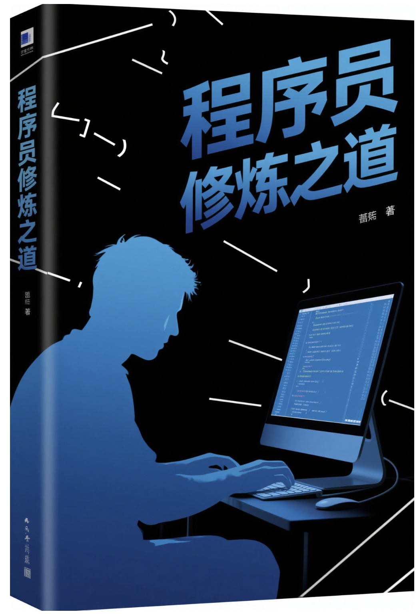

# 中国 35 岁程序员修炼之道 2025

> The-Way-of-Training-for-35-year-old-Programmers-in-China-2025

> 中国35岁程序员在2025年如何提升自我或应对职场挑战的指南。
在中国科技行业，35岁常被视为程序员职业生涯的一个转折点，本书探讨了相关的职业发展策略。

AI天才研究院 编著

AI Genius Institute, 2025

---

# 《中国 35 岁程序员修炼之道 2025 》 

The-Way-of-Training-for-35-year-old-Programmers-in-China-2025

AI天才研究院 编著

# 前言

当今，中国IT行业的"35岁现象"成为众多程序员面临的职业挑战。随着人工智能尤其是大模型技术的迅猛发展，程序员职业正在经历历史性转折。本书将全面探讨在2025年背景下，35岁程序员如何完成从传统编程到AI时代的转型，实现职业新突破。

# 第一部分：理解AI时代的程序员危机与机遇

## 第1章：35岁程序员的现状分析

[第1章：35岁程序员的现状分析.md](%E7%AC%AC1%E7%AB%A0%EF%BC%9A35%E5%B2%81%E7%A8%8B%E5%BA%8F%E5%91%98%E7%9A%84%E7%8E%B0%E7%8A%B6%E5%88%86%E6%9E%90.md)

### 1.1 "35岁现象"的本质
### 1.2 传统IT行业的用人模式与年龄歧视
### 1.3 技术更新迭代与知识老化问题
### 1.4 大模型时代对传统编程岗位的冲击
### 1.5 35岁程序员的心理与职业困境分析

## 第2章：AI大模型对程序员行业的颠覆性影响

[第2章：AI大模型对程序员行业的颠覆性影响.md](%E7%AC%AC2%E7%AB%A0%EF%BC%9AAI%E5%A4%A7%E6%A8%A1%E5%9E%8B%E5%AF%B9%E7%A8%8B%E5%BA%8F%E5%91%98%E8%A1%8C%E4%B8%9A%E7%9A%84%E9%A2%A0%E8%A6%86%E6%80%A7%E5%BD%B1%E5%93%8D.md)

### 2.1 大模型时代的技术革命概述
### 2.2 AI代码生成工具与传统编程的对比
### 2.3 低代码/无代码平台的普及及影响
### 2.4 AI对初级开发岗位的替代效应
### 2.5 编程工作的价值重构与新型技能需求

## 第3章：AI时代的职业机遇分析

[第3章：AI时代的职业机遇分析.md](%E7%AC%AC3%E7%AB%A0%EF%BC%9AAI%E6%97%B6%E4%BB%A3%E7%9A%84%E8%81%8C%E4%B8%9A%E6%9C%BA%E9%81%87%E5%88%86%E6%9E%90.md)

### 3.1 AI大模型相关岗位的市场需求与薪资情况
### 3.2 AI与传统行业融合带来的新岗位机会
### 3.3 35岁程序员的特有优势与竞争力
### 3.4 全球与中国AI人才市场对比分析
### 3.5 AI时代技术人才的长期职业发展路径

# 第二部分：AI大模型时代的核心技能构建

## 第4章：AI大模型开发与应用的技术基础

[第4章：AI大模型开发与应用的技术基础.md](%E7%AC%AC4%E7%AB%A0%EF%BC%9AAI%E5%A4%A7%E6%A8%A1%E5%9E%8B%E5%BC%80%E5%8F%91%E4%B8%8E%E5%BA%94%E7%94%A8%E7%9A%84%E6%8A%80%E6%9C%AF%E5%9F%BA%E7%A1%80.md)

### 4.1 大模型技术架构与工作原理
### 4.2 主流大模型框架及技术栈概览
### 4.3 Python与AI编程基础技能
### 4.4 深度学习基础知识体系构建
### 4.5 大模型参数、训练与推理基本概念

## 第5章：大模型应用开发核心技能

[第5章：大模型应用开发核心技能.md](%E7%AC%AC5%E7%AB%A0%EF%BC%9A%E5%A4%A7%E6%A8%A1%E5%9E%8B%E5%BA%94%E7%94%A8%E5%BC%80%E5%8F%91%E6%A0%B8%E5%BF%83%E6%8A%80%E8%83%BD.md)

### 5.1 Prompt工程技术与最佳实践
### 5.2 LangChain与大模型应用架构设计
### 5.3 RAG技术与大模型知识增强方案
### 5.4 大模型微调技术与实践
### 5.5 多模态模型应用开发方法

## 第6章：AI工程化与系统架构能力

[第6章：AI工程化与系统架构能力.md](%E7%AC%AC6%E7%AB%A0%EF%BC%9AAI%E5%B7%A5%E7%A8%8B%E5%8C%96%E4%B8%8E%E7%B3%BB%E7%BB%9F%E6%9E%B6%E6%9E%84%E8%83%BD%E5%8A%9B.md)

### 6.1 大模型工程化最佳实践
### 6.2 大模型应用的系统设计与架构
### 6.3 分布式训练与部署技术
### 6.4 AI系统性能优化与扩展性设计
### 6.5 大模型应用的DevOps实践

## 第7章：AI商业化与产品思维

[第7章：AI商业化与产品思维.md](%E7%AC%AC7%E7%AB%A0%EF%BC%9AAI%E5%95%86%E4%B8%9A%E5%8C%96%E4%B8%8E%E4%BA%A7%E5%93%81%E6%80%9D%E7%BB%B4.md)

### 7.1 AI产品市场分析与商业模式
### 7.2 AI应用的用户体验设计原则
### 7.3 大模型应用的产品规划与路线图设计
### 7.4 AI项目管理与团队协作方法
### 7.5 大模型应用的商业价值评估与ROI分析

# 第三部分：程序员的AI转型实战指南

## 第8章：从传统程序员到AI工程师的转型路径

[第8章：从传统程序员到AI工程师的转型路径.md](%E7%AC%AC8%E7%AB%A0%EF%BC%9A%E4%BB%8E%E4%BC%A0%E7%BB%9F%E7%A8%8B%E5%BA%8F%E5%91%98%E5%88%B0AI%E5%B7%A5%E7%A8%8B%E5%B8%88%E7%9A%84%E8%BD%AC%E5%9E%8B%E8%B7%AF%E5%BE%84.md)

### 8.1 不同编程背景程序员的AI转型策略
### 8.2 自学与培训结合的高效学习方案
### 8.3 AI领域必备证书与认证指南
### 8.4 构建个人AI项目与作品集
### 8.5 程序员转型AI工程师的时间规划与里程碑

## 第9章：大模型应用工程师实战技能

[第9章：大模型应用工程师实战技能.md](%E7%AC%AC9%E7%AB%A0%EF%BC%9A%E5%A4%A7%E6%A8%A1%E5%9E%8B%E5%BA%94%E7%94%A8%E5%B7%A5%E7%A8%8B%E5%B8%88%E5%AE%9E%E6%88%98%E6%8A%80%E8%83%BD.md)

### 9.1 大模型API调用与集成开发实践
### 9.2 企业级大模型应用架构设计
### 9.3 大模型应用性能优化技巧
### 9.4 大模型应用安全与隐私保护措施
### 9.5 大模型应用测试与质量保障方法

## 第10章：AI垂直领域专精指南

[第10章：AI垂直领域专精指南.md](%E7%AC%AC10%E7%AB%A0%EF%BC%9AAI%E5%9E%82%E7%9B%B4%E9%A2%86%E5%9F%9F%E4%B8%93%E7%B2%BE%E6%8C%87%E5%8D%97.md)

### 10.1 AI医疗领域的技术需求与职业机会
### 10.2 AI金融科技的核心场景与发展前景
### 10.3 智能制造与工业AI的技术趋势
### 10.4 AI营销与商业智能的应用方向
### 10.5 政务与公共服务领域的AI应用前景

## 第11章：AI创业与独立开发者之路

[第11章：AI创业与独立开发者之路.md](%E7%AC%AC11%E7%AB%A0%EF%BC%9AAI%E5%88%9B%E4%B8%9A%E4%B8%8E%E7%8B%AC%E7%AB%8B%E5%BC%80%E5%8F%91%E8%80%85%E4%B9%8B%E8%B7%AF.md)

### 11.1 AI创业领域与商机分析
### 11.2 AI工具与产品的创业案例研究
### 11.3 独立AI开发者的盈利模式
### 11.4 利用大模型降低创业门槛的策略
### 11.5 AI创业融资与资源获取指南

# 第四部分：35岁程序员的职业可持续发展

## 第12章：职场竞争力重塑与面试技巧

[第12章：职场竞争力重塑与面试技巧.md](%E7%AC%AC12%E7%AB%A0%EF%BC%9A%E8%81%8C%E5%9C%BA%E7%AB%9E%E4%BA%89%E5%8A%9B%E9%87%8D%E5%A1%91%E4%B8%8E%E9%9D%A2%E8%AF%95%E6%8A%80%E5%B7%A7.md)

### 12.1 AI时代的程序员简历与个人品牌打造
### 12.2 AI岗位面试重点与应对策略
### 12.3 年龄优势包装与经验价值展示
### 12.4 薪资谈判与职业价值重估
### 12.5 远程工作与灵活就业模式的把握

## 第13章：持续学习与知识更新体系

[第13章：持续学习与知识更新体系.md](%E7%AC%AC13%E7%AB%A0%EF%BC%9A%E6%8C%81%E7%BB%AD%E5%AD%A6%E4%B9%A0%E4%B8%8E%E7%9F%A5%E8%AF%86%E6%9B%B4%E6%96%B0%E4%BD%93%E7%B3%BB.md)

### 13.1 AI技术快速迭代下的学习方法论
### 13.2 构建个人知识管理与更新系统
### 13.3 利用大模型辅助学习与研究的技巧
### 13.4 有效的技术社区参与和资源利用
### 13.5 建立终身学习的心态与习惯

## 第14章：职业生涯高阶规划

[第14章：职业生涯高阶规划.md](%E7%AC%AC14%E7%AB%A0%EF%BC%9A%E8%81%8C%E4%B8%9A%E7%94%9F%E6%B6%AF%E9%AB%98%E9%98%B6%E8%A7%84%E5%88%92.md)

### 14.1 AI领域专家、管理者与创业者的选择
### 14.2 技术专家到AI架构师的进阶路径
### 14.3 向AI产品与项目管理方向的转型
### 14.4 构建"AI+"复合型人才差异化优势
### 14.5 40岁以上技术人才的职业发展战略

## 第15章：心理健康与工作生活平衡

[第15章：心理健康与工作生活平衡.md](%E7%AC%AC15%E7%AB%A0%EF%BC%9A%E5%BF%83%E7%90%86%E5%81%A5%E5%BA%B7%E4%B8%8E%E5%B7%A5%E4%BD%9C%E7%94%9F%E6%B4%BB%E5%B9%B3%E8%A1%A1.md)

### 15.1 技术行业中年危机的心理调适
### 15.2 应对职业转型压力的方法
### 15.3 构建健康的工作习惯与生活方式
### 15.4 家庭支持系统与个人成长的平衡
### 15.5 中年程序员的幸福感与成就感构建

# 第五部分：未来展望与战略思考

## 第16章：2025-2030年AI技术与就业趋势预测

[第16章：2025-2030年AI技术与就业趋势预测.md](%E7%AC%AC16%E7%AB%A0%EF%BC%9A2025-2030%E5%B9%B4AI%E6%8A%80%E6%9C%AF%E4%B8%8E%E5%B0%B1%E4%B8%9A%E8%B6%8B%E5%8A%BF%E9%A2%84%E6%B5%8B.md)

### 16.1 通用人工智能对技术工作的深远影响
### 16.2 AI与人类协作的新工作模式
### 16.3 未来五年AI领域的人才需求预测
### 16.4 编程工作的本质转变与价值提升
### 16.5 为更长远的技术变革做准备

## 第17章：持续竞争力与终身价值创造

[第17章：持续竞争力与终身价值创造.md](%E7%AC%AC17%E7%AB%A0%EF%BC%9A%E6%8C%81%E7%BB%AD%E7%AB%9E%E4%BA%89%E5%8A%9B%E4%B8%8E%E7%BB%88%E8%BA%AB%E4%BB%B7%E5%80%BC%E5%88%9B%E9%80%A0.md)

### 17.1 技术人才的终身竞争力构建
### 17.2 知识资本与影响力积累策略
### 17.3 从技术专家到行业思想者的转变
### 17.4 构建个人IP与影响力的方法
### 17.5 35岁之后的长期职业规划框架

## 第18章：中国程序员的全球化视野与机遇

[第18章：中国程序员的全球化视野与机遇.md](%E7%AC%AC18%E7%AB%A0%EF%BC%9A%E4%B8%AD%E5%9B%BD%E7%A8%8B%E5%BA%8F%E5%91%98%E7%9A%84%E5%85%A8%E7%90%83%E5%8C%96%E8%A7%86%E9%87%8E%E4%B8%8E%E6%9C%BA%E9%81%87.md)

### 18.1 全球AI人才市场与跨国就业机会
### 18.2 中国程序员在国际AI领域的竞争优势
### 18.3 语言与文化壁垒的突破策略
### 18.4 国际远程工作与自由职业的机会
### 18.5 构建全球视野下的职业发展路径

# 附录

[附录.md](%E9%99%84%E5%BD%95.md)

## 附录A：AI大模型学习资源指南

### A.1 精选在线课程与学习平台
### A.2 必读技术书籍与论文
### A.3 开源项目与实践资源
### A.4 AI技术社区与网络资源
### A.5 自学计划与路线图模板

## 附录B：AI大模型技术面试指南

### B.1 AI工程师常见面试题目与答案
### B.2 大模型原理与应用知识点梳理
### B.3 技术面试项目演示案例
### B.4 行为面试与软技能展示技巧
### B.5 远程与现场面试的不同策略

## 附录C：AI大模型职业发展案例集

### C.1 传统开发转型AI工程师的成功案例
### C.2 35+程序员的AI创业故事
### C.3 资深技术人才的转型经验分享
### C.4 AI职业发展中的失败教训与反思
### C.5 不同背景程序员的差异化转型路径

## 附录D：AI相关薪资与岗位数据

### D.1 2025年中国主要城市AI岗位薪资指南
### D.2 各行业AI应用开发职位需求分析
### D.3 不同级别AI工程师的能力要求与薪资范围
### D.4 AI远程工作与自由职业的收入状况
### D.5 国内外AI岗位薪资对比与趋势

## 附录E：程序员健康与心理资源

### E.1 技术工作者常见健康问题与预防
### E.2 高效工作与精力管理的最佳实践
### E.3 职业倦怠的识别与应对策略
### E.4 中年危机的心理调适资源
### E.5 工作与家庭平衡的实用建议

# 后记

# 参考文献

---

# 捐赠：AI天才研究院

> Donate to AI Genius Institute:

| 微信                                                    | 支付宝                                                  |
| ------------------------------------------------------- | ------------------------------------------------------- |
|  |  |
